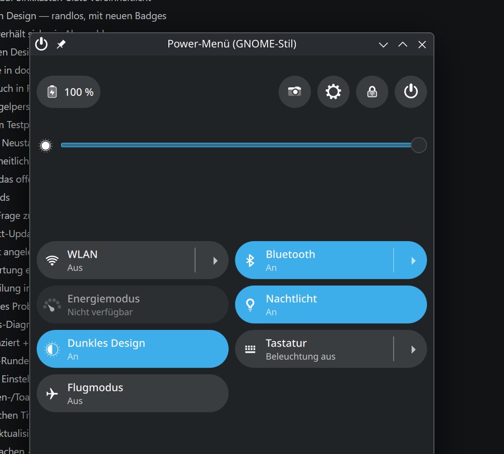

# Power-Menü (GNOME-Stil) für KDE Plasma 6

Ein Plasmoid, das das GNOME-Quick-Settings-Menü nachbildet: Power-Menü,
Akku-Anzeige, Helligkeitsregler und Schnelleinstellungs-Kacheln.



## Funktionen

**Kopfzeile:** Akku-Anzeige (UPower) · Bildschirmfoto (Spectacle) ·
Systemeinstellungen · Bildschirm sperren · Power-Knopf

**Power-Menü:** Bereitschaft · Neustart… · Ausschalten… · Abmelden… ·
Benutzer wechseln… (die „…“-Einträge zeigen den Plasma-Bestätigungsdialog)

**Regler:** Bildschirmhelligkeit (org.kde.ScreenBrightness)

**Kacheln:** WLAN (nmcli) · Bluetooth (bluetoothctl) · Energiemodus
(power-profiles-daemon, Pfeil öffnet Profilauswahl) · Nachtlicht (KWin) ·
Dunkles Design (plasma-apply-colorscheme) · Tastaturbeleuchtung
(PowerDevil, Pfeil öffnet Regler) · Flugmodus (rfkill)

Jedes Element lässt sich in den Widget-Einstellungen einzeln ein- und
ausblenden. Die Farbschemata für „Dunkles Design“ sind dort konfigurierbar
(Standard: Breeze / BreezeDark).

## Installation

```sh
./install.sh            # installiert bzw. aktualisiert
```

Danach: Rechtsklick aufs Panel → „Miniprogramme hinzufügen…“ →
„Power-Menü (GNOME-Stil)“.

## Hinweise

- **Energiemodus** benötigt das Paket `power-profiles-daemon`
  (`sudo pacman -S power-profiles-daemon && sudo systemctl enable --now power-profiles-daemon`).
  Ohne den Dienst ist die Kachel ausgegraut.
- **Benutzer wechseln** nutzt `org.freedesktop.DisplayManager` (SDDM/LightDM).
- **Flugmodus** blockiert alle Funkgeräte per `rfkill block all`.
- Der Helligkeitsregler steuert `display0` (erstes Display von
  org.kde.ScreenBrightness).
